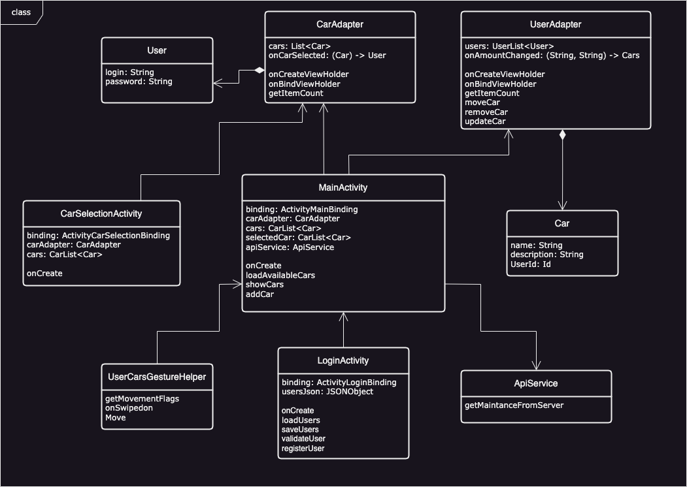

# Диаграмма классов  

 

# Глоссарий

| Класс | Описание |
|:---|:---|
| **MainActivity** | Главное окно приложения, где отображается список автомобилей. |
| **LoginActivity** | Экран авторизации, на котором пользователи вводят данные для входа. |
| **CarSelectionActivity** | Экран выбора автомобиля, где отображаются доступные авто с актуальным пробегом. |
| **CarAdapter** | Адаптер для отображения списка авто на экране выбора автомобиля. |
| **UserAdapter** | Адаптер для взаимодействия со списком авто на главном экране. |
| **User** | Модель данных для представления информации о пользователе. |
| **Car** | Модель данных для представления авто, включая её название, описание и принадлежность пользователю. |
| **ApiService** | Утилита для работы с API хранилища жанных автомобилей РБ, обеспечивающая загрузку тех.обслуживаний. |
| **GestureHelper** | Утилита для обработки жестов, таких как свайп для удаления авто и перетаскивание блоков авто. |
