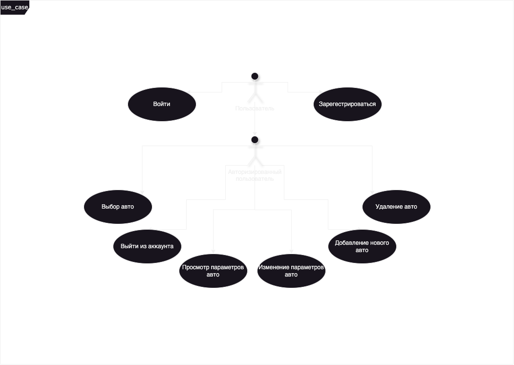

# Сценарий использования "AutoHelper"

 

# Глоссарий

| Термин                     | Определение |
|----------------------------|-------------|
| Пользователь               | Человек, использующий приложение |
| Авторизованный пользователь | Пользователь, прошедший авторизацию в приложении |

# Поток событий

# Содержание
1 [Актёры](#actors)  
2 [Варианты использования](#use_case)  
2.1 [Авторизация пользователя](#user_authentication)  
2.2 [Выбор автомобиля](#select_vehicle)  
2.3 [Добавление записи о техобслуживании](#add_maintenance_record)  
2.4 [Создание напоминания](#create_reminder)  
2.5 [Учет расхода топлива](#fuel_tracking)  
2.6 [Просмотр состояния автомобиля](#view_vehicle_status)  
2.7 [Управление несколькими автомобилями](#manage_multiple_vehicles)

<a name="actors"/>

# 1 Актёры

| Актёр                     | Описание |
|---------------------------|-------------|
| Пользователь              | Человек, использующий приложение для учета данных об обслуживании автомобилей |
| Авторизованный пользователь | Пользователь, прошедший авторизацию в приложении для синхронизации данных |

<a name="use_case"/>

# 2 Варианты использования

<a name="user_authentication"/>

## 2.1 Авторизация пользователя

Описание. Вариант использования "Авторизация пользователя" позволяет пользователю войти в приложение для синхронизации данных.  
Предусловия. Пользователь выбрал пункт "Вход" на экране авторизации.  
Основной поток.
1. Приложение отображает экран авторизации;
2. Пользователь вводит свои данные;
3. Приложение проверяет данные и предоставляет доступ к приложению, если проверка прошла успешно;
4. Вариант использования завершается.

<a name="select_vehicle"/>

## 2.2 Выбор автомобиля

Описание. Вариант использования "Выбор автомобиля" позволяет пользователю выбрать автомобиль, для которого он хочет вести учет данных.  
Предусловия. Пользователь авторизован и находится на главном экране.  
Основной поток.
1. Приложение отображает список добавленных автомобилей;
2. Пользователь выбирает один из автомобилей;
3. Приложение загружает данные, связанные с выбранным автомобилем;
4. Вариант использования завершается.

<a name="add_maintenance_record"/>

## 2.3 Добавление записи о техобслуживании

Описание. Вариант использования "Добавление записи о техобслуживании" позволяет пользователю добавить информацию о проведенном техобслуживании.  
Предусловия. Пользователь выбрал конкретный автомобиль.  
Основной поток.
1. Приложение отображает форму для ввода информации о техобслуживании;
2. Пользователь заполняет поля с данными о проведенных работах;
3. Приложение сохраняет введенные данные и обновляет историю техобслуживания;
4. Вариант использования завершается.

<a name="create_reminder"/>

## 2.4 Создание напоминания

Описание. Вариант использования "Создание напоминания" позволяет пользователю создать напоминание о предстоящем техобслуживании.  
Предусловия. Пользователь выбрал конкретный автомобиль.  
Основной поток.
1. Приложение отображает форму для создания напоминания;
2. Пользователь указывает дату или пробег для следующего обслуживания;
3. Приложение сохраняет напоминание и включает уведомление;
4. Вариант использования завершается.

<a name="fuel_tracking"/>

## 2.5 Учет расхода топлива

Описание. Вариант использования "Учет расхода топлива" позволяет пользователю вести записи о заправках и отслеживать расход топлива.  
Предусловия. Пользователь выбрал конкретный автомобиль.  
Основной поток.
1. Приложение отображает форму для добавления информации о заправке;
2. Пользователь вводит данные о заправке (объем топлива, стоимость, текущий пробег);
3. Приложение рассчитывает и обновляет статистику расхода топлива;
4. Вариант использования завершается.

<a name="view_vehicle_status"/>

## 2.6 Просмотр состояния автомобиля

Описание. Вариант использования "Просмотр состояния автомобиля" позволяет пользователю просмотреть текущие данные и историю обслуживания для выбранного автомобиля.  
Предусловия. Пользователь выбрал конкретный автомобиль.  
Основной поток.
1. Приложение отображает текущие данные по пробегу, последним ремонтам и состоянию автомобиля;
2. Пользователь может просматривать историю техобслуживания и расхода топлива;
3. Вариант использования завершается.

<a name="manage_multiple_vehicles"/>

## 2.7 Управление несколькими автомобилями

Описание. Вариант использования "Управление несколькими автомобилями" позволяет пользователю добавлять, редактировать и удалять информацию о своих автомобилях.  
Предусловия. Пользователь авторизован.  
Основной поток.
1. Приложение отображает список всех добавленных автомобилей;
2. Пользователь может добавлять новый автомобиль или редактировать данные существующего;
3. Пользователь также может удалить автомобиль из списка;
4. Приложение обновляет список автомобилей;
5. Вариант использования завершается.
